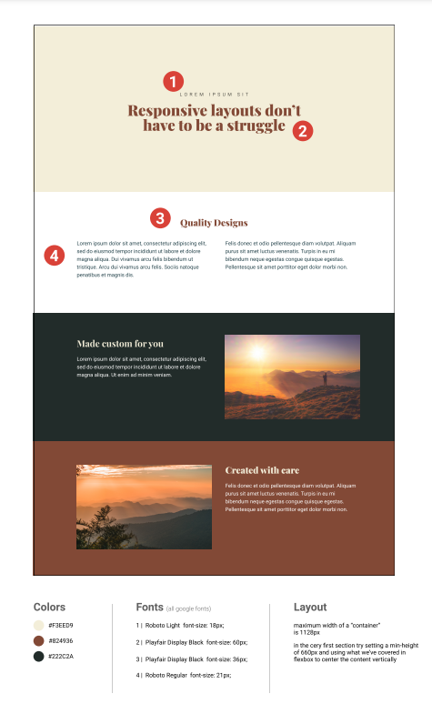
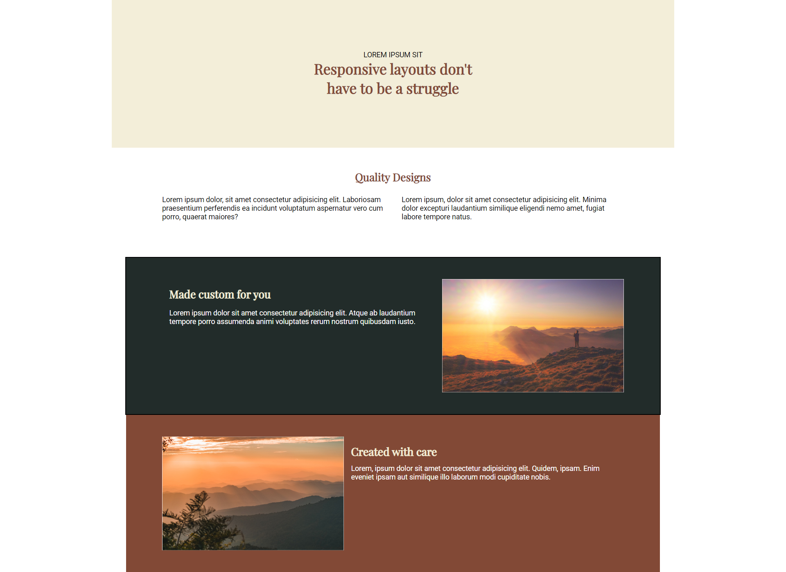
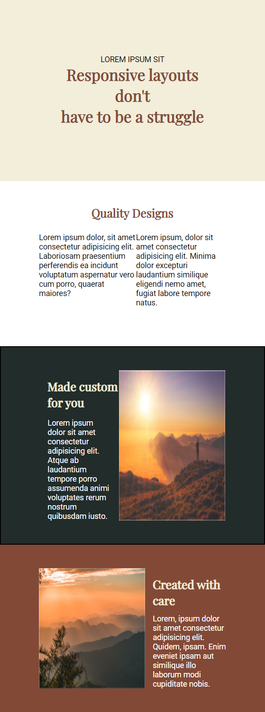
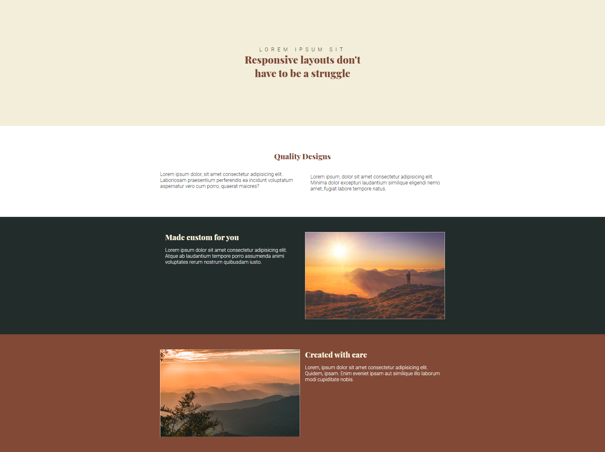
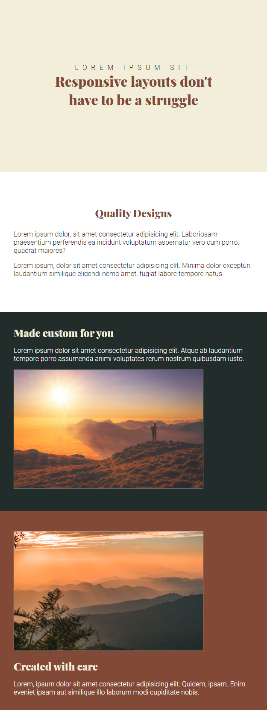

# Flexbox Challenge 4 Solution

## Table of contents

- [Overview](#overview)
 - [The Challenge](#the-challenge)
 - [Screenshot](#screenshot)
 - [Links](#links)
- [Built with](#built-with)
- [Author](#author)

## **Overview**

Hey everyone! I am on day 18 of Kevin Powell's Respnsove Website course. I completed his flexbox challenge 4 and was hoping that someone could review it for me.
When I did the challenge on my own, I did it desktop-first and you can find that solution as [index1.html](index.html) and its corresponding stylesheet [style1.css](style1.css), but when I saw Kevin Powell's solution, he had made the website mobile-first so I decided to do the same and you can find that solution as [index2.html](index2.html) and its corresponding stylesheet [style2.css](style2.css).

 ### The Challenge

 The challenge was to make a responsive website with the provided design.

 

 ### Screenshot

 1. index1.html
  - Desktop
  

  - Mobile
  

 2. index2.html
  - Desktop
  

  - Mobile
  

 ### Links

 - GitHub Live Site URL:
  1. index1.html
   [https://keshavgulati.github.io/Flexbox-ch-04/index1.html](https://keshavgulati.github.io/Flexbox-ch-04/index1.html)
  2. index2.html
  [https://keshavgulati.github.io/Flexbox-ch-04/index2.html](https://keshavgulati.github.io/Flexbox-ch-04/index2.html)

 - Solution:
  1. [index1.html](index1.html), [style1.css](style1.css)
  2. [index2.html](index2.html), [style2.css](style2.css)

### Built With:

- Flexbox
- Media Queries

### Author

- GitHub - [@KeshavGulati](https://github.com/KeshavGulati)
- Frontend Mentor - [@KeshavGulati](https://www.frontendmentor.io/profile/KeshavGulati)
- Hashnode - [https://keshavgulati.hashnode.dev/](https://keshavgulati.hashnode.dev/)